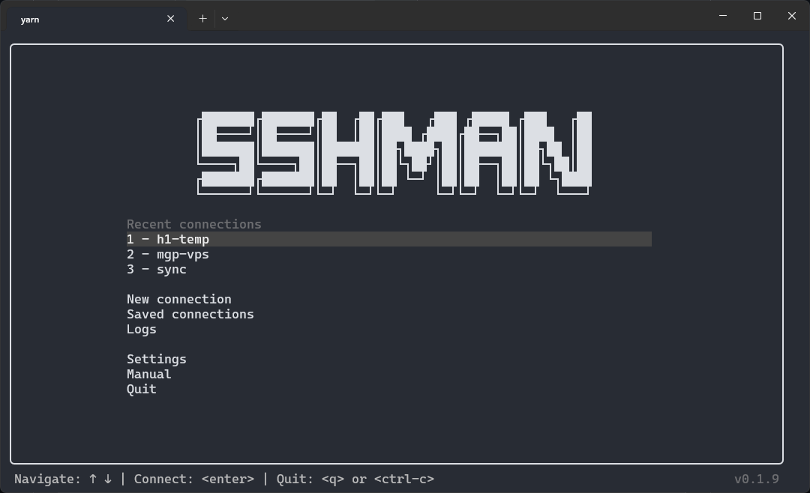
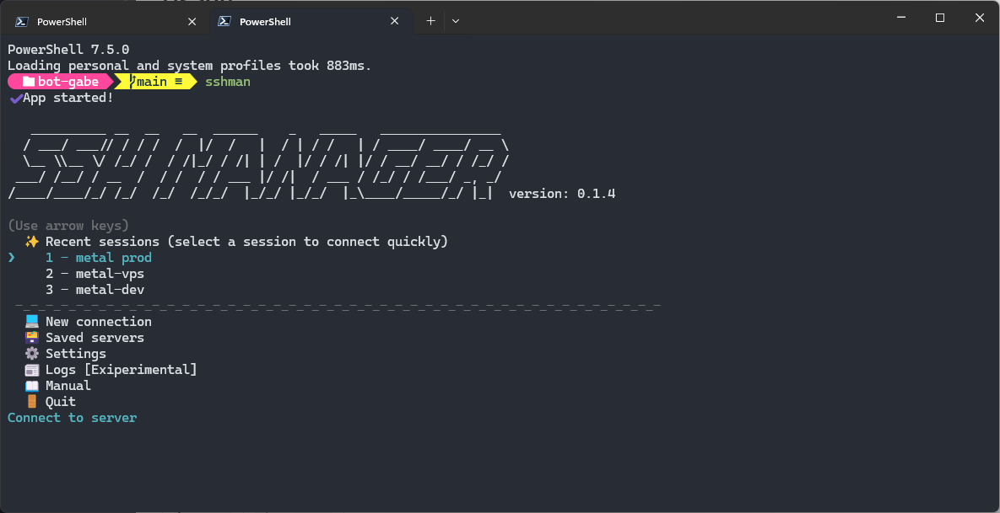

# SSH MANAGER (SSHMAN)
A simple terminmal based SSH manager created in Node.js

# Quick start

## Installation
To get started with `SSH MANAGER` you have to simply install it using your favorite package manager.
| Yarn                                 | NPM                                 | PNPM                             |
| ------------------------------------ | ----------------------------------- | -------------------------------- |
| `yarn global add @eightshone/sshman` | `npm install -g @eightshone/sshman` | `pnpm add -g @eightshone/sshman` |

## Usage
The build of this project exposes the command named `sshman`
### Interactive mode
`sshman`

This mode lets you access the features that SSHMAN offers in an interactive way.

### Commands
#### Connect to a new server
`sshman connect username:[password]@hotsname:[port]`
**Options**:
`--save [server name]` or `-s [server name]`: save the connection for future use.
**Examples**:
`sshman connect username:[password]@hotsname:[port] -s`
`sshman connect username:[password]@hotsname:[port] -s server-name`

#### Connect to a saved server
`sshman connect server-name`
The command doesn't care if the server name contains uppercase or spaces. `Server Name`, `server name`, `server-name`, `SeRvEr-NaMe`, etc. are all the same name for the command.

#### Print logs
`sshman logs`
**Options**:
`--interactive` or `-i`: enter interactive logs listing mode.
`--search <search terms>` or `-s <search terms>`: add filters to standard logs output.
**Examples**:

## Development
### Clone project
`git clone git@github.com:eightshone/ssh-man.git`

### Install dependencies
| Yarn           | NPM           | PNPM           |
| -------------- | ------------- | -------------- |
| `yarn install` | `npm install` | `pnpm install` |

### Start the project
| Yarn       | NPM           | PNPM       |
| ---------- | ------------- | ---------- |
| `yarn dev` | `npm run dev` | `pnpm dev` |

### Build the project
| Yarn         | NPM             | PNPM         |
| ------------ | --------------- | ------------ |
| `yarn build` | `npm run build` | `pnpm build` |

# Roadmap
- [ ] Add delete server command
- [ ] Add reconnect to last server command (this will work even on unsaved servers)
- [ ] Add pagination option to standard logs output 
- [ ] Add automatic script execution features
- [ ] Add config modifier commands
- [ ] Add config encryption options
- [ ] Migrate config files from JSON to binary files