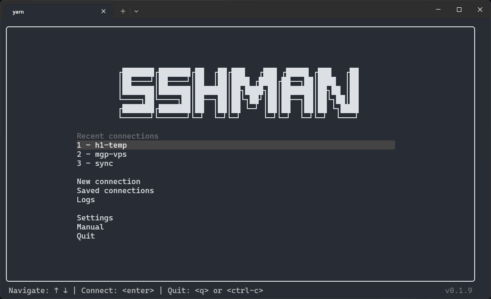

# SSH MANAGER (SSHMAN)

**SSHMAN** is a modern, interactive TUI (Terminal User Interface) SSH connection manager built with Node.js. It simplifies managing multiple SSH sessions with a sleek, user-friendly interface and robust CLI commands.

## Key Features

- **Interactive TUI Dashboard**: A premium terminal experience with rounded borders, ASCII art, and intuitive navigation.
- **Connection Management**: Save, edit, and categorize your SSH connections for quick access.
- **Quick Reconnect**: Jump back into your last session with a single command.
- **Interactive Logs**: Browse and search through your connection history with real-time filtering.
- **Global Search**: Quickly find the server you need from your saved connections.
- **Secure Configuration**: Your connection details are stored in an encrypted format.
- **Import/Export**: Easily share or backup your server configurations.
- **Built-in Manual**: Accessible interactive help documentation within the app.

---

## Quick Start

### Installation

Install `SSHMAN` globally using your preferred package manager:

| Package Manager | Command |
| :--- | :--- |
| **Yarn** | `yarn global add @eightshone/sshman` |
| **NPM** | `npm install -g @eightshone/sshman` |
| **PNPM** | `pnpm add -g @eightshone/sshman` |
| **Bun** | `bun add -g @eightshone/sshman` |

### Usage

#### Interactive Mode
Simply run `sshman` to enter the interactive TUI dashboard.
```bash
sshman
```


#### Command Line Interface
SSHMAN also provides a powerful set of CLI commands for direct access:

- **Connect to a new server**:
  ```bash
  sshman connect username[:password]@hostname[:port] [--save [name]]
  ```
  *Example*: `sshman connect root:password@1.2.3.4:22 -s my-server`

- **Quick Reconnect**:
  ```bash
  sshman reconnect
  ```
  Connects to the last server you accessed.

- **Connect to a saved server**:
  ```bash
  sshman connect server-name
  ```

- **Search for a server**:
  ```bash
  sshman search <terms> [--fuzzy]
  ```

- **Logs**:
  ```bash
  sshman logs [-i] [-s <search terms>]
  ```
  Use `-i` for the interactive TUI logs browser.

- **Export/Import Configs**:
  ```bash
  sshman export [servers...] [-a] [-n <filename>]
  sshman import <config-file> [-f]
  ```

---

## Development

### Setup
1. **Clone the repository**:
   ```bash
   git clone git@github.com:eightshone/ssh-man.git
   ```
2. **Install dependencies**:
   ```bash
   npm install # or yarn install / pnpm install
   ```

### Scripts
- `npm run dev`: Start the project in development mode using `tsx`.
- `npm run build`: Build the project (TypeScript compilation and obfuscation).

## Telemetry

SSHMAN collects anonymous usage data to help improve the tool. This data helps us understand which features are most used and identify performance bottlenecks or common errors.

**Telemetry is strictly opt-in.** You will be prompted to enable it on your first run. No personal information, connection details, or command arguments are ever collected.

### What is collected?
- **Command name**: (e.g., `connect`, `search`) — *Arguments and flags are stripped.*
- **Performance**: Execution duration and success/failure status.
- **Errors**: Sanitized error codes (e.g., `ECONNREFUSED`).
- **System context**: OS, CPU architecture, Node.js version, and SSHMAN version.

### Privacy First
- **No PII**: We never collect IP addresses, usernames, hostnames, or any sensitive configuration.
- **Transparent**: All data is stored locally before being batched and sent.
- **Total Control**: You can change your preference at any time.

### Manage Telemetry
```bash
sshman telemetry status  # Check current status and pending data
sshman telemetry enable  # Opt-in to telemetry
sshman telemetry disable # Opt-out and clear local telemetry data
```

---

License: **MIT**  
Author: **EIGHTSH ONE**