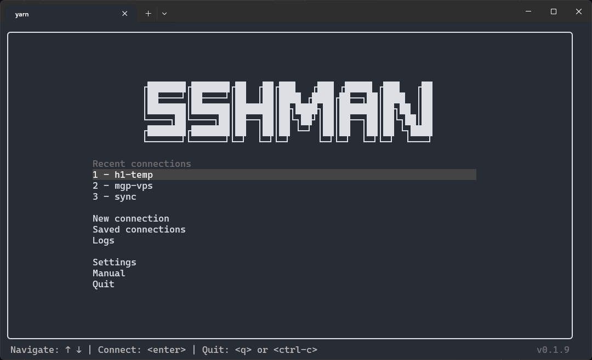

# SSH MANAGER (SSHMAN)

**SSHMAN** is a modern, interactive TUI (Terminal User Interface) SSH connection manager built with Node.js. It simplifies managing multiple SSH sessions with a sleek, user-friendly interface and robust CLI commands.

> ⚠️ **Security Notice**: SSHMAN re-implements the SSH protocol in JavaScript (via the `ssh2` library) rather than shelling out to your system's native `ssh` binary, and does not follow standard SSH client security practices (e.g. host key verification, agent forwarding, and config conventions may differ from OpenSSH). It has not been independently security-audited. Do not treat it as a hardened or compliant SSH client — **use it at your own risk**.

## Key Features

- **Interactive TUI Dashboard**: A premium terminal experience with rounded borders, ASCII art, and intuitive navigation.
- **Connection Management**: Save, edit, and categorize your SSH connections for quick access.
- **Quick Reconnect**: Jump back into your last session with a single command.
- **Interactive Logs**: Browse and search through your connection history with real-time filtering.
- **Global Search**: Quickly find the server you need from your saved connections.
- **Encrypted Configuration**: Your connection details are stored encrypted at rest (see [Configuration Security](#configuration-security)).
- **Import/Export**: Easily share or backup your server configurations, optionally password-protected.
- **MCP Server**: Expose a single saved (or ad-hoc) SSH connection to any MCP-compatible AI client.
- **Built-in Manual**: Accessible interactive help documentation within the app.

---

## Quick Start

### Installation

Install `SSHMAN` globally using your preferred package manager:

| Package Manager | Command |
| :--- | :--- |
| **Yarn** | `yarn global add @eightshone/sshman` |
| **NPM** | `npm install -g @eightshone/sshman` |
| **PNPM** | `pnpm add -g @eightshone/sshman` |
| **Bun** | `bun add -g @eightshone/sshman` |

### Usage

#### Interactive Mode
Simply run `sshman` to enter the interactive TUI dashboard.
```bash
sshman
```


#### Command Line Interface
SSHMAN also provides a powerful set of CLI commands for direct access:

- **Connect to a new server**:
  ```bash
  sshman connect username[:password]@hostname[:port] [--save [name]]
  ```
  *Example*: `sshman connect root:password@1.2.3.4:22 -s my-server`

- **Quick Reconnect**:
  ```bash
  sshman reconnect
  ```
  Connects to the last server you accessed.

- **Connect to a saved server**:
  ```bash
  sshman connect server-name
  ```

- **Search for a server**:
  ```bash
  sshman search <terms> [--fuzzy]
  ```

- **Logs**:
  ```bash
  sshman logs [-i] [-s <search terms>]
  ```
  Use `-i` for the interactive TUI logs browser.

- **Export/Import Configs**:
  ```bash
  sshman export [servers...] [-a] [-n <filename>] [-e | -p <password>]
  sshman import <config-file> [-f] [-p <password>]
  ```
  Pass `-e` (prompted) or `-p <password>` to encrypt/decrypt the exported file with its own password, independent of the local machine-derived key.

- **MCP Server**:
  ```bash
  sshman mcp server-name
  sshman mcp username[:password]@hostname[:port] [-p]
  ```
  Starts a [Model Context Protocol](https://modelcontextprotocol.io) server over stdio for a single SSH connection, so an MCP-compatible AI client can run commands, read/write files, list directories, and drive an interactive shell on that one server. See [MCP Server](#mcp-server) below.

- **Goodbye**:
  ```bash
  sshman goodbye
  ```
  Prints a random farewell message. Mostly here for fun.

---

## MCP Server

`sshman mcp <server-name-or-connection-string>` opens a single SSH connection and exposes it as an MCP server over stdio, so it can be wired into any MCP-compatible client (e.g. Claude Code, Claude Desktop) as a tool provider scoped to that one host. It exposes:

| Tool | Description |
| :--- | :--- |
| `run_command` | Run a shell command and return stdout, stderr, and exit code. |
| `read_file` | Read a text file from the remote host. |
| `write_file` | Write (overwrite) a text file on the remote host. |
| `list_directory` | List the contents of a remote directory. |
| `start_shell` | Start a persistent interactive shell session. |
| `send_input` | Send input to the running interactive shell. |
| `read_shell_output` | Read output produced by the interactive shell since the last read. |
| `close_shell` | Close the interactive shell session. |

Because stdout is reserved for the MCP JSON-RPC stream, `sshman mcp` skips the interactive first-run telemetry prompt and any other interactive output — configure telemetry via `sshman telemetry` beforehand if you have an opinion on it.

---

## Configuration Security

Saved server configurations (hosts, usernames, passwords, private key paths) are encrypted at rest with AES-256-GCM. By default the encryption key is derived from your machine's hostname and username plus a locally-stored random salt — this protects the config file from casual inspection (e.g. someone copying the file off your disk) but is **not** a substitute for full-disk encryption or a dedicated secrets manager, since anyone with shell access to your account can derive the same key. If you need a config file that's safe to share or store elsewhere, use `sshman export -e` (or `-p <password>`) to encrypt it with your own password instead.

---

## Troubleshooting

- **Debug mode**:
  ```bash
  sshman debug enable   # turn on advanced troubleshooting output
  sshman debug disable
  sshman debug status
  ```

- **Check for updates**:
  ```bash
  sshman check-updates
  ```

---

## Development

### Setup
1. **Clone the repository**:
   ```bash
   git clone git@github.com:eightshone/ssh-man.git
   ```
2. **Install dependencies**:
   ```bash
   npm install # or yarn install / pnpm install
   ```

### Scripts
- `npm run dev`: Start the project in development mode using `tsx`.
- `npm run build`: Compile TypeScript to `dist/`.
- `npm run typecheck`: Type-check the project without emitting output.
- `npm test`: Run the test suite (Node's built-in test runner via `tsx`).

A Husky pre-commit hook runs `typecheck` and `test` before every commit.

---

## Telemetry

SSHMAN collects anonymous usage data to help improve the tool. This data helps us understand which features are most used and identify performance bottlenecks or common errors.

**Telemetry is strictly opt-in.** You will be prompted to enable it on your first run. No personal information, connection details, or command arguments are ever collected.

### What is collected?
- **Command name**: (e.g., `connect`, `search`) — *Arguments and flags are stripped.*
- **Performance**: Execution duration and success/failure status.
- **Errors**: Sanitized error codes (e.g., `ECONNREFUSED`).
- **System context**: OS, CPU architecture, Node.js version, and SSHMAN version.

### Privacy First
- **No PII**: We never collect IP addresses, usernames, hostnames, or any sensitive configuration.
- **Transparent**: All data is stored locally before being batched and sent.
- **Total Control**: You can change your preference at any time.

### Manage Telemetry
```bash
sshman telemetry status  # Check current status and pending data
sshman telemetry enable  # Opt-in to telemetry
sshman telemetry disable # Opt-out and clear local telemetry data
```

---

License: **MIT**
Author: **EIGHTSH ONE**
